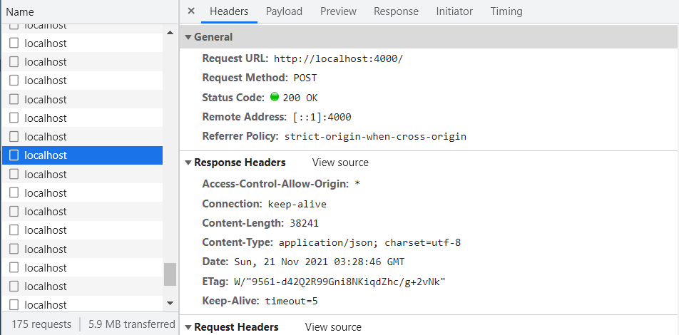
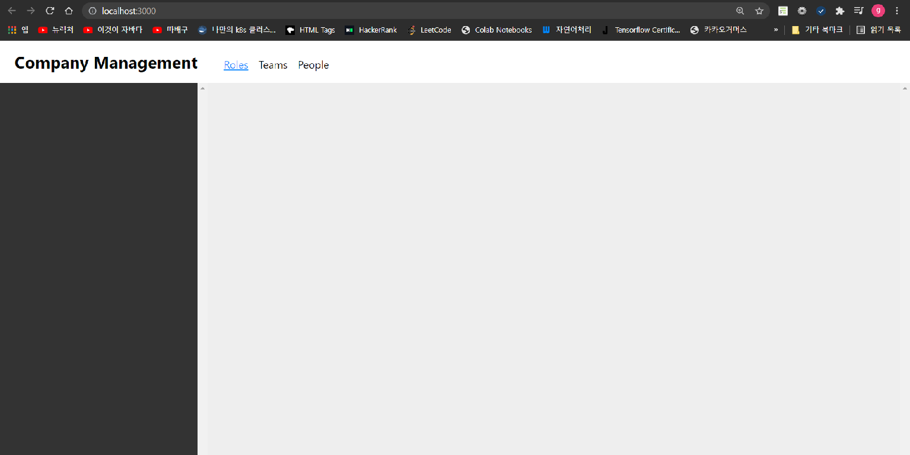

# GraphQL
- [Youtube 얄팍한 코딩사전의 얄팍한 GraphQL & Apollo 강좌](https://www.youtube.com/watch?v=9BIXcXHsj0A)을 학습하면서 정리한 페이지
- [얄팍한 코딩사전의 얄팍한 GraphQL & Apollo 강좌 GitHub 페이지](https://www.yalco.kr/@graphql-apollo/1-1/) 참조
## 강의 준비물
- Node.js
  - 자바스크립트를 내 컴퓨터에서 실행할 수 있도록 해주는 환경
  - 다운로드 위치: https://nodejs.org/en/
- Visual Studio Code
  - 마이크로소프트에서 만든 소스코드 에디터
- 실습 코드
```bash
$git clone https://gitlab.com/yalco/yalco-inflearn-graphql-apollo.git
```
## GraphQL이 등장하기 전 - REST API란?
- 소프트웨어간 정보를 주고받는 방식
  - GraphQL 이전부터 사용
  - GraphQL과는 다른 방식 - 용도와 작업특성에 따라 적합한 것 사용
- 만약에 Client가 서버에 특정 동네의 인기업소에 대한 리스트에 대한 요청을 보내면, 서버는 아래와 같이 응답
```javascript
[
  {
    name: '30분짜장',
    category: 'chinese',
    tel: '##-####-####',
    rating: 4.6
  },
  {
    name: '피자파자마',
    category: 'italian',
    tel: '##-####-####',
    rating: 3.9
  },
  {
    name: '공중떡볶이',
    category: 'snack',
    tel: '##-####-####',
    rating: 4.9
  },
  ///...
]
```
- 데이터를 주고받을 주체들간 약속된 형식
  - URI 형식(어떤 정보를) X 요청 방식(어떻게 할 것인가)      

| 요청 형식  | 용도 |
| --------- | ----------- |
| GET       | 정보 받아오기|
| POST      | 정보 입력하기|  
| PUT/PATCH | 정보 수정하기|  
| DELETE    | 정보 삭제하기|
### 요청 보내기 실습
- 1-2-rest-api 프로젝트 실행
```bash
# nodemon 설치. 특정 프로젝트가 아닌 시스템에 설치
# 소스 코드가 바뀌면, 다시 실행해줌.
# 실행 시, node가 아니라, nodemon으로 실행하면 됨
npm install -g nodemon
#
# 프로젝트 모듈 설치
npm install
#
# 프로젝트 실행 명령어 (해당 프로젝트 폴더에서)
nodemon index.js
# 브라우저에서 localhost:3000 으로 확인
```
- VS Code의 Edit csv 확장: 데이터 수정에 용이
- Postman을 사용하여 정보 요청해 보기
- talend API tester를 이용하여 접속해 봄
#### 팀(들), 팀원 목록 받아오기
- GET 방식을 이용하여 데이터 가져 오기

| 요청 형식  | URI |
| --------- | ----------- |
| GET       | localhost:3000/api/team|
| GET       | localhost:3000/api/team/{id 번호}|  
| GET       | localhost:3000/api/people|  
| GET       | localhost:3000/api/people?{변수}={값}&{변수}={값} ...|
| GET       | localhost:3000/api/team/{id 번호}/people|
- 사용예 1: 개발자이면서 혈액형이 O형인 사람들의 목록을 받고 싶을 경우
```javascript
# GET 방식
http://localhost:3000/api/people?role=developer&blood_type=O
```
- 사용예 2: id가 1인 team의 사람들의 목록을 받고 싶은 경우
```javascript
# GET 방식
http://localhost:3000/api/team/1/people
```
#### 팀 추가 하기
- POST 방식을 이용하여 데이터 생성
| 요청 형식  | URI |
| --------- | ----------- |
| POST      | localhost:3000/api/team|
```javascript
# POST 방식
http://localhost:3000/api/team
Content-type:application/json
Req Body:
{
"manager": "Kim, KyuSham",
"office": "777A",
"extension_number": "#7750",
"mascot": "Tiger",
"cleaning_duty": "Monday",
"project": "Smart-Work"
}

Response Body:
{
"id": 6,
"manager": "Kim, KyuSham",
"office": "777A",
"extension_number": "#7750",
"mascot": "Tiger",
"cleaning_duty": "Monday",
"project": "Smart-Work"
}
```
#### 팀 수정 하기
- PUT 방식을 이용하여 데이터 수정
| 요청 형식  | URI |
| --------- | ----------- |
| PUT       | localhost:3000/api/team/{id 번호}|
```javascript
# PUT 방식
http://localhost:3000/api/team/6
Content-type:application/json
Req Body:
{
"manager": "David",
"office": "777A",
"extension_number": "#7750",
"mascot": "Lion",
"cleaning_duty": "Tuesday",
"project": "Smart-Work"
}

Response Body:
{
"manager": "David",
"office": "777A",
"extension_number": "#7750",
"mascot": "Lion",
"cleaning_duty": "Tuesday",
"project": "Smart-Work",
"id": "6"
}
```
#### 팀 삭제 하기
- DELETE 방식을 이용하여 데이터 수정
| 요청 형식  | URI |
| --------- | ----------- |
| DELETE    | localhost:3000/api/team/{id 번호}|
```javascript
# DELETE 방식
http://localhost:3000/api/team/6

Response Body:
[
    {
    "manager": "David",
    "office": "777A",
    "extension_number": "#7750",
    "mascot": "Lion",
    "cleaning_duty": "Tuesday",
    "project": "Smart-Work",
    "id": "6"
    }
]
```
### REST API의 한계
#### Case 1. 각 팀의 메니저와 오피스 호수만 필요할 때
- Overfectching 이슈
  - 딱 필요한 정보들만 받아올 수는 없을까?
  - 아래의 JSON Object처럼, 팀의 ``manager``과 ``office``정보만 추출하고 싶다면?
```javascript
[
  {
    "manager": "Mandy Warren",
    "office": "101A",
  },
  {
    "manager": "Stewart Grant",
    "office": "101B",
  },
  {
    "manager": "Smantha Wheatly",
    "office": "102A",
  },
  // ...
]
```
#### Case 2. 특정 팀의 매니저와 팀원들 명단이 필요할 때
- Underfectching 이슈
  - 내가 원하는 정보가 여러 계층에 걸쳐져 있는 경우
  - 필요한 정보들을 한번의 요청으로 받아올 수 없을까?
  - REST API의 경우, 팀의 정보를 받아오고 난 후, 다시 사람들의 정보를 다시 받아와야 함
```javascript
{
  "manager": "Mandy Warren",
  "members": [
    {
      "first_name": "Nathan",
      "last-name": "Jenkins"
    },
    {
      "first_name": "Isabella",
      "last-name": "Martin"
    },
    {
      "first_name": "Kate",
      "last_name": "Owen"
    },
    //...
  ]
}
```
## GraphQL로 정보 주고 받아보기
### 체험 프로젝트 실행
- 1-3-graphql-exp 프로젝트 실행
```bash
# package.json과 package-lock.json을 토대로 프로젝트 모듈 설치
$npm install
# 프로젝트 실행 명령어 (해당 프로젝트 폴더에서)
$nodemon index.js
Server ready at http://localhost:4000/
# 브라우저에서 localhost:4000 으로 확인
```
- Chrome 브라우저에서 ``localhost:4000``에 접속하면, apollo playground를 사용할 수 있음
- 사용예 1: 브라우저에서 팀들에 대한 모든 정보 요청
```bash
# Write your query or mutation here
query {
  teams {
    id
    manager
    office
    extension_number
    mascot
    cleaning_duty
    project
  }
}
```
- 사용예 2: 브라우저에서 팀들에 대한 ``manager``와 ``office`` 정보 요청
  - **REST API의 Overfectching 이슈가 해결**
```bash
# Write your query or mutation here
query {
  teams {
    manager
    office
  }
}
```
- 사용예 3: 특정 팀의 정보만 요청
```bash
# Write your query or mutation here
query {
  team(id:2) {
    id
    manager
    extension_number
    mascot
  }
}
```
- 사용예 4: 팀 정보와 해당 팀 멤버들의 정보들 받아오기
```bash
# Write your query or mutation here
query {
  team(id: 1) {
    manager
    office
    members {
      first_name
      last_name
    }
  }
}
```
- 사용예 5: 팀 목록과 역할 목록 받아오기
  - **Underfectching 이슈 해결**
```bash
# Write your query or mutation here
query {
  teams {
    manager
    office
    mascot
  }
  roles {
    id
    requirement
  }
}
```
- 사용예 6: 새 팀 추가
  - mutation 사용
```bash
mutation {
  postTeam (input: {
    manager: "John Smith"
    office: "104B"
    extension_number: "#9982"
    mascot: "Dragon"
    cleaning_duty: "Monday"
    project: "Lordaeron"
  }) {
    manager
    office
    extension_number
    mascot
    cleaning_duty
    project
  }
}
```
- 사용예 7: 특정 번호의 팀 정보 수정
  - mutation 사용
```bash
mutation {
  editTeam(id: 2, input: {
    manager: "Maruchi Han"
    office: "105A"
    extension_number: "2315"
    mascot: "Direwolf"
    cleaning_duty: "Wednesday"
    project: "Haemosu"
  }) {
    id,
    manager,
    office,
    extension_number,
    mascot,
    cleaning_duty,
    project
  }
}
```
- 사용예 8: 특정 번호의 팀 삭제
  - mutation 사용
```bash
mutation {
  deleteTeam(id: 3) {
    id,
    manager,
    office,
    extension_number,
    mascot,
    cleaning_duty,
    project
  }
}
```  
### GraphQL의 특징과 강점
- 필요한 정보들만 선택하여 받아올 수 있음
  - Overfectching 문제 해결
  - 데이터 전송량 감소
- 여러 계층의 정보들을 한 번에 받아올 수 있음
  - Underfetching 문제 해결
  - 요청 횟수 감소  
- 하나의 endpoint에서 모든 요청을 처리
  - **하나의 URI에 POST로 모든 요청 가능**


## Apollo의 역할
- GraphQL로 서비스를 만들려면?
  - **GraphQL은 명세, 형식일 뿐**
- GraphQL 구현한 프레임워크의 역할과 종류
  - 백엔드에서 정보를 제공 및 처리
  - 프런트엔드에서 요청 전송
  - 백엔드 프레임워크: Apollo Server, [GrapQL.js](https://www.npmjs.com/package/graphql), [GraphQL Yoga](https://github.com/dotansimha/graphql-yoga)
  - 프런트엔드 프레임워크: Apollo Client, [AWS Amplify](https://docs.amplify.aws/), [Relay](https://relay.dev/)...
  - [프레임워크 전체 살펴보기- https://graphql.org/code/](https://graphql.org/code/)
- Apollo GraphQL을 사용한 이유
  - [사이트-https://www.apollographql.com/](https://www.apollographql.com/)
  - **백엔드와 프런트엔드 모두 제공**
  - 간편하고 쉬운 설정
  - 풍성한 기능을 제공
  - Apollo Client로 React, Vue, angular 모두 제공
  - 해당 사이트에서 Apollo Turitorial을 읽으면 도움
- 이 강의에서 만들어 볼 것
  - Apollo Server를 활용한 백엔드 서버 제작
    - [사이트-https://www.apollographql.com/docs/apollo-server/](https://www.apollographql.com/docs/apollo-server/)
  - Apollo Client와 React를 활용한 프런트엔드 웹 제작
    - [사이트-https://www.apollographql.com/docs/react/](https://www.apollographql.com/docs/react/)
## GraphQL 서버 만들어 보기
### Apollo 서버 구축 하기
#### 프로젝트 시작하기
- GraphQL을 사용하는 백엔드 서버
##### 프로젝트 생성
- ``chap-2-lession-1`` 폴더 생성
- 프로젝트 폴더 생성 뒤 VS Code에서 열기
- ``Ctrl + shift + ` ``로 터미널 창 열기
- Node.js 프로젝트 생성
  - ``package.json`` 파일 생성
```bash
#$ npm init --help
#npm init
#Create a package.json file
$npm init
```
- index.js 파일 생성
```javascript
console.log('프로젝트 생성 완료')
// 터미널에 nodemon index.js로 테스트
```
- ``package.json - "scripts" 항목에 실행 명령 추가 
```javascript
....
"scripts": {
    "test": "echo \"Error: no test specified\" && exit 1",
    "start": "nodemon index.js"
  }
....  
```
- 실행명령 테스트
  - ``node`` 명령어로 직접 실행하는 방법
  - ``nodedemon`` 명령어로 직접 실행하는 방법(daemon형태로 실행)
    - 바뀐 소스코드가 변경할 때 마다 다시 실행됨
  - ``npm`` 명령어로 ``package.json``을 통해서 실행하는 방법
```bash
$ node index.js
```
```bash
$ nodemon index.js
```
```bash
$npm start
```
##### Mock 데이터베이스 모듈 삽입
- Yaco님의 ``2-1-graphql-api-setup`` 폴더 안 내용들을 프로젝트로 이동
- index.js
```javascript
const database = require('./database')
console.log(database)
```
- 필요 모듈 설치 뒤 테스트
```bash
# i means install
$npm i convert-csv-to-json
$npm start
```
- VS Code에 Edit csv 확장설치(선택)
##### Apollo 서버 설치
- 필요 모듈 설치 뒤 테스트
  - 설치 시, ``package.json``과 ``package-lock.json``의 ``dependency``가 자동 변경
```bash
$npm i graphql apollo-server
```
- Apollo 서버 실행
  - index.js에 붙여 넣기
  - 서버 실행
```javascript
// index.js
const database = require('./database')
const { ApolloServer, gql } = require('apollo-server')
const typeDefs = gql`
  type Query {
    teams: [Team]
  }
  type Team {
    id: Int
    manager: String
    office: String
    extension_number: String
    mascot: String
    cleaning_duty: String
    project: String
  }
`
const resolvers = {
  Query: {
    teams: () => database.teams
  }
}
const server = new ApolloServer({ typeDefs, resolvers })
server.listen().then(({ url }) => {
console.log(`🚀  Server ready at ${url}`)
})
```
```bash
$npm start
```
- 쿼리 테스트
  - apollo playground에서 해당 포트에 접
```GraphQL
query {
  teams {
    id
    manager
    office
    extension_number
    mascot
    cleaning_duty
    project
  }
}
```
#### index.js내의 코드 설명
- typeDef
  - GraphQL 명세에서 사용될 데이터, 요청의 타입 지정
  - gql([template literal tag](https://developer.mozilla.org/en-US/docs/Web/JavaScript/Reference/Template_literals#tagged_templates))로 생성됨
- resolver
  - 서비스의 액션들을 함수로 지정
  - 요청에 따라 데이터를 반환, 입력, 수정, 삭제를 처리
- GraphQL Playground
  - 작성한 GraphQL type, resolver 명세 확인
  - 데이터 요청 및 전송 테스트
### Query 구현하기
- 지난 실습 그대로 진행 또는 ``2-2-server-query`` 열기
#### Query 루트 타입
- 자료 요청에 사용될 쿼리들을 정의
- 쿼리 명령문마다 반환될 데이터 형태를 지정
- 사용자가 쿼리 ``teams``를 요청할 경우, ``Team`` Type을 배열로 리턴
```javascript
type Query {
    teams: [Team]
}
```
#### Type 살펴 보기
- 반환될 데이터의 형태를 지정
- 자료형을 가진 필드들로 구성
```javascript
type Team {
    id: Int
    manager: String
    office: String
    extension_number: String
    mascot: String
    cleaning_duty: String
    project: String
}
```
#### Resolver 살펴보기
- Query란 object의 항목들로 데이터를 반환하는 함수 선언
  - 아래의 예제 코드는 화살표 함수 사용
- 실제 프로젝트에서는 MySQL 조회 코드 등..
```javascript

const resolvers = {
  Query: {
    teams: () => database.teams
  }
}
```
#### equipments를 반환하는 쿼리 만들어 보기
- ``dbtester.js`` 생성
```javascript
const database = require('./database')
console.log(database.equipments)
```
- ``equipment``의 데이터 자료형
  - ``index.js`` 파일에 추가
```javascript
type Equipment {
    id: String
    used_by: String
    count: Int
    new_or_used: String
}
```
- Query Root에 ``equipment``를 반환하는 쿼리 추가
```javascript
type Query {
    ...
    equipments: [Equipment]
}
```
- 데이터베이스에서 equipments를 추출하여 반환하는 resolver 추가
```javascript
Query: {
    // ... 
    equipments: () => database.equipments
}
```
- Apollo playground에서 쿼리 요청해 보기
```javascript
query {
    equipments {
        id
        used_by
        count
        new_or_used
    }
}
```
#### supplies 받아오기 추가
- ``index.js``에 type 정의, 쿼리 추가, resolver 추가
```javascript
query {
    ...
    type Supply {
        id: String
        team: Int
    }
}
```
```javascript
type Query {
    ...
    supplies: [Supply]
}
```
```javascript
type Query {
    //...
    supplies: () => database.supplies
}
```
- Apollo playground에서 쿼리 요청해 보기
```javascript
query {
  equipments {
    id
    used_by
    count    
  }

  supplies {
    id
    team
  }
}
```
#### 특정 team만 받아오기
- ``index.js``에 type 정의, 쿼리 추가, resolver 추가
- args로 주어진 id에 해당하는 team만 필터링하여 반환
```javascript
type Query {
    ...
    team(id: Int): Team
}
```
```javascript
Query: {
    //...
    team: (parent, args, context, info) => database.teams
        .filter((team) => {
            return team.id === args.id
        })[0],
}
```
- Apollo Playground에서 쿼리 수행해 보기
```javascript
query {
  team(id:1) {
    id
    manager
    office
    extension_number
    mascot
    cleaning_duty
    project
  }
}
```
#### team에 supplies 연결해서 받아오기
- Team 목록 또는 특정 Team을 반환시 해당하는 supplies를 ``supplies``항목에 추가
- ``type Team``에 ``supplies`` 항목을 추가: 다수의 ``Supply``를 반환
```javascript
type Team {
    id: Int
    manager: String
    office: String
    extension_number: String
    mascot: String
    cleaning_duty: String
    project: String
    supplies: [Supply]
}
```
- Team 목록 또는 특정 Team을 반환 시 해당하는 supplies를 ``supplies``항목에 추가
```javascript
const resolvers = {
  Query: {
    teams: () => database.teams.map((team) => {
        team.supplies = database.supplies.filter((supply) => {
            return supply.team === team.id
        })
        return team
    }),
    team: (parent, args, context, info) => database.teams.filter((team) => {
             return team.id === args.id
        }).map((team) => {
            team.supplies = database.supplies.filter((supply) => {
                return supply.team === team.id
            })
            return team            
        })[0],
    equipments: () => database.equipments,
    supplies: () => database.supplies
  }
}
```
- Apollo Playground에서 쿼리 실행해 보기
```javascript
query {
  team(id:2) {
    id
    manager
    office
    extension_number
    mascot
    cleaning_duty
    project
    supplies {
      id
      team
    }
  }
}
```
```javascript
query {
  teams {
    id
    manager
    office
    extension_number
    mascot
    cleaning_duty
    project
    supplies {
      id
      team
    }
  }
}
```
### Mutation 구현하기
- 지난 실습 그대로 진행 또는 ``2-3-server-mutation`` 열기
#### Equipment 데이터 삭제 하기
##### Mutation - 삭제 루트 타입
- String 인자 ``id``를 받는 ``deleteEquipment``: 삭제된 ``Equipment``를 반환
```javascript
type Mutation {
    deleteEquipment(id: String): Equipment
}
```
##### 삭제 resolver
- 삭제 후, 결과값으로 받아올 데이터를 ``deleted``변수에 저장
- 데이터에서 해당 데이터 삭제 후, ``deleted`` 반환
- 실제 프로젝트에서는 SQL의 DELETE문으로 구현
```javascript
Mutation: {
      deleteEquipment: (parent, args, context, info) => {
          const deleted = database.equipments
              .filter((equipment) => {
                  return equipment.id === args.id
              })[0]
          database.equipments = database.equipments
              .filter((equipment) => {
                  return equipment.id !== args.id
              })
          return deleted
      }
}
```
##### Apollo playground에서 쿼리 실행
```javascript
mutation {
  deleteEquipment(id: "notebook") {
    id
    used_by
    count
    new_or_used
  }
}
```
#### Equipment 데이터 추가 하기
##### Mutation - 추가 루트 타입
- 추가할 ``Equipment``의 요소 값들을 인자로 받고 추가된 ``Equipment``를 반환
```javascript
type Mutation {
    insertEquipment(
        id: String,
        used_by: String,
        count: Int,
        new_or_used: String
    ): Equipment
    ...
}
```
##### 추가 resolver
```javascript
Mutation: {
    insertEquipment: (parent, args, context, info) => {
        database.equipments.push(args)
        return args
    },
    //...
}
```
##### Apollo playground에서 쿼리 실행
```javascript
mutation {
  insertEquipment (
    id: "laptop",
    used_by: "developer",
    count: 17,
    new_or_used: "new"
  ) {
    id
    used_by
    count
    new_or_used
  }
}
```
#### Equipment 데이터 수정 하기
##### Mutation - 수정 루트 타입
- 수정할 ``Equipment``의 요소 값들을 인자로 받고 수정 ``Equipment``를 반환
```javascript
type Mutation {
    editEquipment(
        id: String,
        used_by: String,
        count: Int,
        new_or_used: String
    ): Equipment
    ...
}
```
##### 수정 resolver
```javascript
Mutation: {
    // ...
    editEquipment: (parent, args, context, info) => {
        return database.equipments.filter((equipment) => {
            return equipment.id === args.id
        }).map((equipment) => {
            Object.assign(equipment, args)
            return equipment
        })[0]
    },
    // ...
}
```
##### Apollo playground에서 쿼리 실행
```javascript
mutation {
  editEquipment (
    id: "pen tablet",
    new_or_used: "new",
    count: 30,
    used_by: "designer"
  ) {
    id
    new_or_used
    count
    used_by
  }
}
```
## GraphQL 서버 깊이 파보기
### 서버 구성요소 모듈화
- 3-1-server-modularized 열기
#### apollo-server 생성자 인자 모듈화
- [apollo-server](https://www.apollographql.com/docs/apollo-server/api/apollo-server/) 문서 참조
  - ``typeDefs``: 단일 변수 또는 배열로 지정 가능
  - ``resolvers``: 단일 Object 또는 Merge 된 배열로 가능
- ``typeDefs``와 ``resolvers``들을 별도의 파일들에 분리 시킴
- ``typedefs-resolvers/equipments.js``
  - ``type Equipment``의 정의와 resolvers의 구현이 존재
```javascript
// ...
const typeDefs = gql`
    type Equipment {
        id: String
        used_by: String
        count: Int
        new_or_used: String
    }
`
const resolvers = {
    Query: {
        equipments: (parent, args) => dbWorks.getEquipments(args),
    },
    Mutation: {
        deleteEquipment: (parent, args) => dbWorks.deleteItem('equipments', args),
    }
}
// ...
```  
- ``typedefs-resolvers/_queries.js``
  - Query에 대한 정의가 존재
```javascript
// ...
const typeDefs = gql`
    type Query {
        equipments: [Equipment]
    }
`
// ...
```
- ``typedefs-resolvers/_mutations.js``
  - Mutation에 대한 정의가 존재  
```javascript
// ...
const typeDefs = gql`
    type Mutation {
      deleteEquipment(id: String): Equipment
    }
`
// ...
```
- package.json에 포함된 package들과 의존성 Package들을 설치
```bash
$ npm install
```
- 서버 시작
```bash
$ npm start
```
- Apollo Playground를 이용해서 GraphQL 수행
```javascript
query {
  equipments {
    id
    new_or_used
    used_by
    count    
  }
}
```
#### ``dbWorks.js`` 살펴보기
- Resolver에 사용할 기능들을 모듈화
#### ``Supply`` 모듈 추가해 보기
- ``typedefs-resolvers/supplies.js``
  - ``type Supply``의 정의와 resolvers의 구현이 존재
```javascript
const { gql } = require('apollo-server')
const dbWorks = require('../dbWorks')

const typeDefs = gql`
    type Supply {
        id: String
        team: Int
    }
`
const resolvers = {
    Query: {
        supplies: (parent, args) => dbWorks.getSupplies(args)
    },
    Mutation: {
        deleteSupply: (parent, args) => dbWorks.deleteItem('supplies', args),
    }
}

module.exports = {
    typeDefs: typeDefs,
    resolvers: resolvers
}
```  
- ``typedefs-resolvers/_queries.js``
  - Query에 대한 정의가 존재
```javascript
// ...
const typeDefs = gql`
    type Query {
        ...
        supplies: [Supply]
    }
`
// ...
```
- ``typedefs-resolvers/_mutations.js``
  - Mutation에 대한 정의가 존재
```javascript
// ...
const typeDefs = gql`
    type Mutation {
        ...
        deleteSupply(id: Stgring): Supply
    }
`
// ...
```
- ``typedefs-resolvers/index.js``
  - Supply를 위한 ``Query, Mutation, type Supply정의``를 추가
```javascript
// ...
const supplies = require('./typedefs-resolvers/supplies')
// ...
const typeDefs = [
    // ...
    supplies.typeDefs
]
const resolvers = [
    // ...
    supplies.resolvers
]
// ...
```
- Apollo playground에서 Query와 Mutation 수행해 보기
```javascript
query {
  supplies {
    id
    team
  }
}
```
```javascript
mutation {
  deleteSupply(id: "mug") {
    id
    team
  }
}
```
### GraphQL의 기본 타입들
- 지난 실습 그대로 진행 또는 3-2 types 열기
#### 스칼라 타입
- GraphQL 내장 자료형

| 타입      | 설명 |
| --------- | ----------- |
| ID        | 기본적으로는 String이나, 고유 식별자 역할임을 나타내는 일종의 약속|
| String    | UTF-8 문자열|
| Int       | 부호가 있는 32비트 정수|
| Float     | 부호가 있는 부동소수점 값|
| Boolean   | 참/거짓|	

- ``!`` : Non Null
  - null을 반환할 수 없음
  - 만약, null을 반환하면 graphQL 서버에서 에러가 발생
- ``equipments.js``에 새로운 타입과 resolver를 정의  
```javascript
type EquipmentAdv {
    id: ID!
    used_by: String!
    count: Int!
    use_rate: Float
    is_new: Boolean!
}
```
```javascript
const resolvers = {
    Query: {
        // ...
        equipmentAdvs: (parent, args) => dbWorks.getEquipments(args)
            .map((equipment) => {
                if (equipment.used_by === 'developer') {
                    equipment.use_rate = Math.random().toFixed(2)
                }
                equipment.is_new = equipment.new_or_used === 'new'
                return equipment
            }),
    },
    // ...
}
```
- ``_queries.js``에 새로운 Query 추가
```javascript
type Query {
    ...
    equipmentAdvs: [EquipmentAdv]
    ...
}
```
- Apollo Playground에서 Query 수행
```javascript
query {
    equipmentAdvs {
        id
        used_by
        count
        use_rate
        is_new
    }
}
```
#### 열거 타입
- 미리 지정된 값들 중에서만 반환
- ``_enums.js``
```javascript
const { gql } = require('apollo-server')
const typeDefs = gql`
    enum Role {
        developer
        designer
        planner
    }
    enum NewOrUsed {
        new
        used
    }
`
module.exports = typeDefs
```
- ``index.js``
```javascript
// ...
const enums = require('./typedefs-resolvers/_enums')
// ...
const typeDefs = [
    // ...
    enums,
    // ...
]
```
- ``equipments.js``
```javascript
const typeDefs = gql`
    type Equipment {
        id: ID!
        used_by: Role!
        count: Int!
        new_or_used: NewOrUsed!
    }
    type EquipmentAdv {
        id: ID!
        used_by: Role!
        count: Int!
        use_rate: Float
        is_new: Boolean!
    }
`
```
- Apollo Playground를 이용하여 Query 수행
```javascript
query {
  equipments {
    id
    used_by
    count
    new_or_used
  }
	equipmentAdvs {
    id
    used_by
    count
    use_rate
    is_new
  }
}
```
#### 리스트 타입
- 특정 타입의 배열을 반환
- ``equipments.js``의 ``users`` 항목
```javascript
const typeDefs = gql`
    // ...
    type EquipmentAdv {
        id: ID!
        used_by: Role!
        count: Int!
        use_rate: Float
        is_new: Boolean!,
        users: [String!]
    }
`
// ...
const resolvers = {
    Query: {
        // ...
        equipmentAdvs: (parent, args) => dbWorks.getEquipments(args)
            .map((equipment) => {
                if (equipment.used_by === 'developer') {
                    equipment.use_rate = Math.random().toFixed(2)
                }
                equipment.is_new = equipment.new_or_used === 'new'
                if (Math.random() > 0.5) {
                    equipment.users = []
                    dbWorks.getPeople(args).forEach((person) => {
                        if (person.role === equipment.used_by && Math.random() < 0.2) {
                            equipment.users.push(person.last_name)
                        }
                    })
                }
                return equipment
            }),
    },
    // ...
}
```
- Apollo Playground를 이용하여 Query 수행
```javascript
query {
  equipmentAdvs {
    id
    used_by
    count
    use_rate
    is_new
    users
  }
}
```
| 선언부   | users: null | users: [ ] | users: [..., null] |
| --------- | ----------- | ----------- | ----------- |
|[String]	 |  ✔          |	✔          |	✔          |
|[String!] |	✔          |	✔	         |  ❌         |
|[String]! |	❌         |	 ✔          |  ✔          |
|[String!]!|	❌         |  ✔          |	 ❌         |

#### 객체 타입
- 사용자에 의해 정의된 타입들
  - 아래 파일의 ``Team, Equipment, Supply``가 객체 타입
```javascript
const typeDefs = gql`
  type Team {
    id: Int
    manager: String
    office: String
    extension_number: String
    mascot: String
    cleaning_duty: String
    project: String
    supplies: [Supply]
  }
  type Equipment {
      id: String
      used_by: String
      count: Int
      new_or_used: String
  }
  type Supply {
      id: String
      team: Int
  }
`
```
### 유니언과 인터페이스
- 3-3-union-interface 새로 열기
#### Union
- 여러 타입의 결과값을 한 배열에 반환하고자 할 때 사용
##### Equipment와 Supply를 함께 반환하기
- ``givens.js``
  - ``return``에 Equipment 배열과 Supply 배열을 합친 새로운 배열 생성 (Spread 연산자)
```javascript
const { gql } = require('apollo-server')
const dbWorks = require('../dbWorks.js')
const typeDefs = gql`
    union Given = Equipment | Supply
`
const resolvers = {
    Query: {
        givens: (parent, args) => {
            return [
                ...dbWorks.getEquipments(args),
                ...dbWorks.getSupplies(args)
            ]
        }
    },
    Given: {
        __resolveType(given, context, info) {
            if (given.used_by) {
                return 'Equipment'
            }
            if (given.team) {
                return 'Supply'
            }
            return null
        }
    }
}
module.exports = {
    typeDefs: typeDefs,
    resolvers: resolvers
}
```
- ``_queries.js``
```javascript
const typeDefs = gql`
    type Query {
        // ...
        givens: [Given]
    }
`
```
- ``index.js``
```javascript
// ...
const givens = require('./typedefs-resolvers/givens')
// ...
const typeDefs = [
    // ...
    givens.typeDefs
]
// ...
const resolvers = [
    // ...
    givens.resolvers
]
// ...
```
- Apollo playground에서 아래의 쿼리 수행
```javascript
query {
  givens {
    __typename
    ... on Equipment {
      id
      used_by
      count
      new_or_used
    }
    ... on Supply {
      id
      team
    }
  }
}
```
- 쿼리 수행 결과
```javascript
{
  "data": {
    "givens": [
      ....
      {
        "__typename": "Equipment",
        "id": "whiteboard",
        "used_by": "planner",
        "count": 12,
        "new_or_used": "used"
      },
      {
        "__typename": "Equipment",
        "id": "sketchboard",
        "used_by": "designer",
        "count": 48,
        "new_or_used": "new"
      },
      {
        "__typename": "Supply",
        "id": "ergonomic mouse",
        "team": 1
      },
      {
        "__typename": "Supply",
        "id": "mug",
        "team": 1
      },
      ....
    ]
  }
}
```
#### interface
- 유사한 객체 타입을 만들기 위한 공통 필드 타입
- 추상 타입
  - 다른 타입에 ``implement`` 되기 위한 타입
  - 공통적으로 가진 필드: ``id, used_by``
```javascript
type Equipment {
    id: ID!
    used_by: Role!
    count: Int
    new_or_used: NewOrUsed!
}
...
type Software {
    id: ID!
    used_by: Role!
    developed_by: String!
    description: String
}
```  
- ``tools.js``
```javascript
const { gql } = require('apollo-server')
const typeDefs = gql`
    interface Tool {
        id: ID!
        used_by: Role!
    }
`
const resolvers = {
    Tool: {
        __resolveType(tool, context, info) {
            if (tool.developed_by) {
                return 'Software'
            }
            if (tool.new_or_used) {
                return 'Equipment'
            }
            return null
        }
    }
}
module.exports = {
    typeDefs: typeDefs,
    resolvers: resolvers
}
```
- ``equipments.js``
```javascript
type Equipment implements Tool {
    id: ID!
    used_by: Role!
    count: Int
    new_or_used: NewOrUsed!
}
```
- ``software.js``
```javascript
type Software implements Tool {
    id: ID!
    used_by: Role!
    developed_by: String!
    description: String
}
```
- ``index.js``
```javascript
// ...
const tools = require('./typedefs-resolvers/tools')
// ...
const typeDefs = [
    // ...
    tools.typeDefs
]
// ...
const resolvers = [
    // ...
    tools.resolvers
]
// ...
```
- ``Apollo Playground``에서 Query 수행
```javascript
query {
  equipments {
    id
    used_by
    count
    new_or_used
  }
  softwares {
    id
    used_by
    description
    developed_by
  }
}
```
##### People 쿼리에 적용
- ``people.js``
```javascript
const { gql } = require('apollo-server')
const dbWorks = require('../dbWorks.js')
const typeDefs = gql`
    type People {
        id: ID!
        first_name: String!
        last_name: String!
        sex: Sex!
        blood_type: BloodType!
        serve_years: Int!
        role: Role!
        team: ID!
        from: String!
        tools: [Tool]
        givens: [Given]
    }
`
const resolvers = {
    Query: {
        people: (parent, args) => dbWorks.getPeople(args),
        person: (parent, args) => dbWorks.getPeople(args)[0]
    }
}
module.exports = {
    typeDefs: typeDefs,
    resolvers: resolvers
}
```
- ``_queries.js``
```javascript
const typeDefs = gql`
    type Query {
        people: [People],
        // ...
    }
`
```
- ``index.js``
```javascript
// ...
const people = require('./typedefs-resolvers/people')
// ...
const typeDefs = [
    // ...
    people.typeDefs
]
// ...
const resolvers = [
    // ...
    people.resolvers
]
// ...
```
- ``Apollo Playground`` Query 수행
```javascript
query {
  people {
    id
    first_name
    last_name
    givens {
        __typename
    	... on Equipment {
      	id
      	used_by
      	count
      	new_or_used
    	}
    	... on Supply {
      	id
      	team
    	}
  	}
    tools {
      __typename
      ... on Equipment {
        id
        used_by
        count
        new_or_used
      }
      ... on Software {
        id
        used_by
        description
        developed_by
      }
    }
  }
}
```
### Argument와 Input Type
- 지난 실습 그대로 진행 또는 3-4-arg-input-type 열기
#### People 데이터 조건들로 필터 넣어 받아오기
- ``_queries.js``
```javascript
    type Query {
        ...
        peopleFiltered(
            team: Int, 
            sex: Sex, 
            blood_type: BloodType, 
            from: String
        ): [People]
        ...
    }
```
- ``people.js``
```javascript
  Query: {
    // ...
    peopleFiltered: (parent, args) => dbWorks.getPeople(args),
  }
```
- 필터링에 관련된 로직은 이미 ``dbWorks.js``파일의 ``dataFiltered`` 변수에 존재
- ``Apollo Playground``에서 아래의 query 수행
```javascript
query {
  peopleFiltered (
    team: 1
    blood_type: B
    from: "Texas"
  ) {
    id
    first_name
    last_name
    sex
    blood_type
    serve_years
    role
    team
    from
  }
}
```
- 주의 사항으로, ``Apollo Playground`` query를 생성할 때, enum type에 대해서는 ``""``를 사요하지 않음
```javascript
query {
  peopleFiltered (
    sex: female
    from: "California"
  ) {
    id
    first_name
    last_name
    sex
    blood_type
    serve_years
    role
    team
    from
  }
}
```
#### 페이지로 나누어 받아오기
- ``_queries.js``
```javascript
    type Query {
        ...
        peoplePaginated(
            page: Int!,
            per_page: Int!
        ): [People]
        ...
    }
```
- ``people.js``
```javascript
    Query: {
        // ...
        peoplePaginated: (parent, args) => dbWorks.getPeople(args),
        // ...
    }
```
- page와 관련된 로직은 이미 ``dbWorks.js``파일의 ``dataFiltered`` 변수에 존재
- ``Apollo Playground`` query 수행
```javascript
query {
	peoplePaginated(page: 1, per_page: 7) {
    id
    first_name
    last_name
    sex
    blood_type
    serve_years
    role
    team
    from
  }
}
```
- 아래와 같이 ``_queries.js``를 수정하여 필터링과 페이징을 함께 할 수도 있음
```javascript
query {
        peopleFiltered(
            team: Int, 
            sex: Sex, 
            blood_type: BloodType, 
            from: String,
            page: Int!,
            per_page: Int!
        ): [People]
}
```
- ``team``이 2인 People을 페이징 처리하는 ``Apollo Playground`` query
```javascript
query {
	peoplePaginated(team: 2, page: 2, per_page: 7) {
    id
    first_name
    last_name
    sex
    blood_type
    serve_years
    role
    team
    from
  }
}
```
#### 별칭으로 받아오기
- 결과 데이터에 별칭을 붙여서 가져오는 ``Apollo Playground`` query 수행 방법
```javascript
query {
	badGuys:peopleFiltered(blood_type:B, sex:male) {
    id
    first_name
    last_name
    sex
    blood_type
    serve_years
    role
    team
    from
  }
  newYorkers:peopleFiltered(from:"New York") {
    id
    first_name
    last_name
    sex
    blood_type
    serve_years
    role
    team
    from
  }
}
```
- 아래와 같이 결과 데이터가 반환
```javascript
{
  "data": {
    "badGuys": [
      {
        "id": "3",
        "first_name": "Nathan",
        "last_name": "Jenkins",
        "sex": "male",
        "blood_type": "B",
        "serve_years": 1,
        "role": "planner",
        "team": "1",
        "from": "Texas"
      },
      {
        "id": "25",
        "first_name": "Brian",
        "last_name": "Hunt",
        "sex": "male",
        "blood_type": "B",
        "serve_years": 2,
        "role": "planner",
        "team": "1",
        "from": "Indiana"
      }
    ],
    "newYorkers": [
      {
        "id": "16",
        "first_name": "Toby",
        "last_name": "Lewis",
        "sex": "male",
        "blood_type": "A",
        "serve_years": 1,
        "role": "planner",
        "team": "3",
        "from": "New York"
      },
      {
        "id": "36",
        "first_name": "Chloe",
        "last_name": "Bailey",
        "sex": "female",
        "blood_type": "A",
        "serve_years": 5,
        "role": "developer",
        "team": "4",
        "from": "New York"
      },
      {
        "id": "42",
        "first_name": "Russ",
        "last_name": "Lawrence",
        "sex": "male",
        "blood_type": "O",
        "serve_years": 5,
        "role": "designer",
        "team": "1",
        "from": "New York"
      }
    ]
  }
}
```
#### Input Type
- query 또는 mutation의 입력 인자의 개수가 너무 많은 경우, 구조화 시켜서 사용
- ``people.js``
```javascript
const typeDefs = gql`
    ....
    input PostPersonInput {
        first_name: String!
        last_name: String!
        sex: Sex!
        blood_type: BloodType!
        serve_years: Int!
        role: Role!
        team: ID!
        from: String!
    }
`
const resolvers = {
    // ...
    Mutation: {
        postPerson: (parent, args) => dbWorks.postPerson(args),
    }
}
```
- ``_mutation.js``
```javascript
type Mutation {
    postPerson(input: PostPersonInput): People!
    ...
}
```
- ``Apollo Playground``에서 query 수행
```javascript
mutation {
  postPerson(input: {
    first_name: "Hanna"
    last_name: "Kim"
    sex: female
    blood_type: O
    serve_years: 3
    role: developer
    team: 1
    from: "Pusan"
  }) {
    id
    first_name
    last_name
    sex
    blood_type
    role
    team
    from
  }
}
```
## GraphQL 클라이언트 만들어 보기
### React와 Apollo Client
- SPA와 React의 개념
  - [참고 영상](https://youtu.be/iE29lbjbow0)
### Chapter 4 실습
- ⭐1-3-graphql-exp 폴더에서 **서버 실행하기**
```bash
$npm start
> 1-3-graphql-exp@1.0.0 start
> nodemon index.js

[nodemon] 2.0.15
[nodemon] to restart at any time, enter `rs`
[nodemon] watching path(s): *.*
[nodemon] watching extensions: js,mjs,json
[nodemon] starting `node index.js`
🚀  Server ready at http://localhost:4000
```
- 4-1-react-before-apollo 폴더 열기
- React 모듈 설치
```bash
$npm install -g react-scripts
```
- 필요한 패키지 install
```bash
$npm install
```
- React Client 실행
  - 3000번 포트로 실행
```bash
$npm start
```

#### 코드 살펴 보기
- ``App.js``

| 코드  | 설명 |
| --------- | ----------- |
| NavMenus  | menu값에 따라 상단 App-header의 버튼을 표시하는 함수|
| mainComp  | App-header 아래 메인 화면에 나타날 컴포넌트 매핑|

- ``roles.js, teams.js, people.js``

| 코드  | 설명 | 비고 |
| --------- | ----------- | ----------- |
| AsideItems |	메인화면 왼쪽의 사이드 섹션 |	리스트가 나타날 곳 |
| MainContents |	메인화면 | 리스트 각 항목의 내용부가 표시될 곳 | 	

#### Apollo Client 사용하기
- [아폴로 클라이언트 문서](https://www.apollographql.com/docs/react/get-started/)
- 아폴로 클라이언트 모듈 적용
```bash
$npm install @apollo/client graphql
```
- App.js
```javascript
// ...
import { ApolloProvider } from '@apollo/client';
import { ApolloClient, InMemoryCache } from '@apollo/client'
// ...
```
- ApolloClient 모듈 임포트
  - App.js
```javascript
// ...
const client = new ApolloClient({
  uri: 'http://localhost:4000',
  cache: new InMemoryCache()
});
// ...
```  
| 코드  | 설명 |
| --------- | ----------- |
| client | GraphQL 서버로와 정보를 주고받을 ApolloClient 객체 |
| uri |	GraphQL 서버의 주소 | 	
| cache |	InMemoryCache를 통한 캐시 관리 |
- ``App.js``의 return 구문에서 내부 요소들을 ApolloProvider 로 감싸준다.
```javascript
//   ...
  return (
    <div className="App">
      <ApolloProvider client={client}>
        <header className="App-header">
          <h1>Company Management</h1>
          <nav>
            <ul>
              {NavMenus()}
            </ul>
          </nav>
        </header>
        <main>
          {mainComp[menu]}
        </main>
      </ApolloProvider>
    </div>
  );
//   ...
```
##### GraphQL 서버로부터 목록 받아와 표시하기
- ``roles.js``
  - 필요한 모듈들 임포트
  - 쿼리 작성
  - 렌더링될 컨텐츠 id를 저장할 state 지정
  - AsideItems 함수에서, GraphQL로부터 데이터를 받아와 목록을 렌더링하도록 작성
```javascript
// ...
import { useState } from 'react';
import { useQuery, gql } from '@apollo/client';
// ...
// ...
const GET_ROLES = gql`
  query GetRoles {
    roles {
      id
    }
  }
`;
// ...
// ...
  const [contentId, setContentId] = useState('');
// ...
// ...
  function AsideItems () {
    const roleIcons = {
      developer: '💻',
      designer: '🎨',
      planner: '📝'
    }
    const { loading, error, data } = useQuery(GET_ROLES);
    if (loading) return <p className="loading">Loading...</p>
    if (error) return <p className="error">Error :(</p>
    return (
      <ul>
        {data.roles.map(({id}) => {
          return (
            <li key={id} className={'roleItem ' +  (contentId === 'id' ? 'on' : '')}
            onClick={() => {setContentId(id)}}>
              <span>{contentId === id ? '🔲' : '⬛'}</span>
              {roleIcons[id]} {id}
            </li>
          )
        })}
      </ul>
    );
  }
// ...
```

| 코드  | 설명 |
| --------- | ----------- |
| loading | GraphQL 서버에서 정보를 받아오는 동안 표시 |
| error | 요청에 오류가 발생할 시 반환 |
| data | GraphQL 요청대로 받아진 정보 |

##### GraphQL 서버로부터 id로 컨텐츠 받아와 표시하기
- ``roles.js``
  - query 작성
  - ``MainContents()`` 함수 수정

```javascript
// ...
const GET_ROLE = gql`
  query GetRole($id: ID!) {
    role(id: $id) {
      id
      requirement
      members {
        id
        last_name
        serve_years
      }
      equipments {
        id
      }
      softwares {
        id
      }
    }
  }
`;
// ...
  function MainContents() {

    const { loading, error, data } = useQuery(GET_ROLE, {
      variables: {id: contentId}
    })

    if (loading) return <p className="loading">Loading...</p>
    if (error) return <p className="error">Error :(</p>
    if (contentId === '') return (<div className="roleWrapper">Select Role</div>)

    return (
      <div className="roleWrapper">
        <h2>{data.role.id}</h2>
        <div className="requirement"><span>{data.role.requirement}</span> required</div>
        <h3>Members</h3>
        <ul>
          {data.role.members.map((member) => {
            return (<li>{member.last_name}</li>)
          })}
        </ul>
        <h3>Equipments</h3>
        <ul>
          {data.role.equipments.map((equipment) => {
            return (<li>{equipment.id}</li>)
          })}
        </ul>
        <h3>Softwares</h3>
          {data.role.softwares.map((software) => {
            return (<li>{software.id}</li>)
          })}
        <ul>
        </ul>
      </div>
    );
  }
```
##### Query와 Mutation을 사용하여 웹페이지 만들기
- ``teams.js``
  - 모듈 로드
  - State 준비
```javascript
// ...
import { useState } from 'react';
import { useQuery, useMutation, gql } from '@apollo/client'
// ...
// ...
  const [contentId, setContentId] = useState(0)
  const [inputs, setInputs] = useState({
    manager: '',
    office: '',
    extension_number: '',
    mascot: '',
    cleaning_duty: '',
    project: ''
  })
// ...
```
###### 팀목록 받아오기 
- 쿼리 작성: ``teams.js``
```javascript
// ...
const GET_TEAMS = gql`
  query GetTeams {
    teams {
        id
        manager
        members {
          id
          first_name
          last_name
          role
        }
      }
  }
`;
// ...
```
- 팀 목록을 받아와 보여주기 함수: ``teams.js``
```javascript
// ...
  function AsideItems () {
    const roleIcons = {
      developer: '💻',
      designer: '🎨',
      planner: '📝'
    }

    const { loading, error, data, refetch } = useQuery(GET_TEAMS);

    if (loading) return <p className="loading">Loading...</p>
    if (error) return <p className="error">Error :(</p>

    return (
      <ul>
        {data.teams.map(({id, manager, members}) => {
          return (
            <li key={id}>
              <span className="teamItemTitle" onClick={() => {setContentId(id)}}>
                Team {id} : {manager}'s
              </span>
              <ul className="teamMembers">
                {members.map(({id, first_name, last_name, role}) => {
                  return (
                    <li key={id}>
                      {roleIcons[role]} {first_name} {last_name}
                    </li>
                  )
                })}
              </ul>
            </li>
          )
        })}
      </ul>
    )
  }
// ...
```
###### 팀 항목 받아오기
- 쿼리 작성: ``teams.js``
```javascript
// ...
const GET_TEAM = gql`
  query GetTeam($id: ID!) {
    team(id: $id) {
        id
        manager
        office
        extension_number
        mascot
        cleaning_duty
        project
      }
  }
`;
// ...
```
- 항목 받아와 보여주기 함수: ``teams.js``
```javascript
// ...
function MainContents () {

    const { loading, error } = useQuery(GET_TEAM, {
      variables: {id: contentId},
      onCompleted: (data) => {
        if (contentId === 0) {
          setInputs({
            manager: '',
            office: '',
            extension_number: '',
            mascot: '',
            cleaning_duty: '',
            project: ''
          })
        } else {
          setInputs({
            manager: data.team.manager,
            office: data.team.office,
            extension_number: data.team.extension_number,
            mascot: data.team.mascot,
            cleaning_duty: data.team.cleaning_duty,
            project: data.team.project
          })
        }
      }
    });

    if (loading) return <p className="loading">Loading...</p>
    if (error) return <p className="error">Error :(</p>

    function handleChange(e) {
      const { name, value } = e.target
      setInputs({
        ...inputs,
        [name]: value
      })
    }

    return (
      <div className="inputContainer">
        <table>
          <tbody>
            {contentId !== 0 && (
              <tr>
                <td>Id</td>
                <td>{contentId}</td>
              </tr>
            )}
            <tr>
              <td>Manager</td>
              <td><input type="text" name="manager" value={inputs.manager} onChange={handleChange}/></td>
            </tr>
            <tr>
              <td>Office</td>
              <td><input type="text" name="office" value={inputs.office} onChange={handleChange}/></td>
            </tr>
            <tr>
              <td>Extension Number</td>
              <td><input type="text" name="extension_number" value={inputs.extension_number} onChange={handleChange}/></td>
            </tr>
            <tr>
              <td>Mascot</td>
              <td><input type="text" name="mascot" value={inputs.mascot} onChange={handleChange}/></td>
            </tr>
            <tr>
              <td>Cleaning Duty</td>
              <td><input type="text" name="cleaning_duty" value={inputs.cleaning_duty} onChange={handleChange}/></td>
            </tr>
            <tr>
              <td>Project</td>
              <td><input type="text" name="project" value={inputs.project} onChange={handleChange}/></td>
            </tr>
          </tbody>
        </table>
        {contentId === 0 ? 
          (<div className="buttons">
            <button onClick={() => {}}>Submit</button>
          </div>
          ) : (
          <div className="buttons">
            <button onClick={() => {}}>Modify</button>
            <button onClick={() => {}}>Delete</button>
            <button onClick={() => {setContentId(0)}}>New</button>
          </div>
          )}
      </div>
    )
  }
//   ...
```
###### 항목 삭제하기
- 쿼리와 함수 작성: ``teams.js``
```javascript
// ...
const DELETE_TEAM = gql`
  mutation DeleteTeam($id: ID!) {
    deleteTeam(id: $id) {
      id
    }
  }
`
// ...
  function execDeleteTeam () {
    if (window.confirm('이 항목을 삭제하시겠습니까?')) {
      deleteTeam({variables: {id: contentId}})
    }
  }
  const [deleteTeam] = useMutation(
  DELETE_TEAM, { onCompleted: deleteTeamCompleted })
  function deleteTeamCompleted (data) {
    console.log(data.deleteTeam)
    alert(`${data.deleteTeam.id} 항목이 삭제되었습니다.`)
    setContentId(0)
  }
    // ...
```
- 버튼에 적용: ``teams.js``
```javascript
// ...
    <button onClick={execDeleteTeam}>Delete</button>
// ...
```
- 수정된 데이터를 다시 로드
```javascript
// ...
let refetchTeams
// ...
refetchTeams = refetch
// ...
alert(`${data.deleteTeam.id} 항목이 삭제되었습니다.`)
refetchTeams()
// ...
```    
###### 항목 수정하기
- 쿼리와 함수 작성: ``teams.js``
```javascript
// ...
const EDIT_TEAM = gql`
  mutation EditTeam($id: ID!, $input: PostTeamInput!) {
    editTeam(id: $id, input: $input) {
      id,
      manager,
      office,
      extension_number,
      mascot,
      cleaning_duty,
      project
    }
  }
`
// ...
  function execEditTeam () {
    editTeam({
      variables: {  
        id: contentId,
        input: inputs }
      })
  }
  const [editTeam] = useMutation(
    EDIT_TEAM, { onCompleted: editTeamCompleted }) 
  function editTeamCompleted (data) {
    console.log(data.editTeam)
    alert(`${data.editTeam.id} 항목이 수정되었습니다.`)
    refetchTeams()
  }
```
- 버튼에 적용: ``teams.js``
```javascript
//   ...
    <button onClick={execEditTeam}>Modify</button>
//   ...
```
###### 항목 추가하기
- 쿼리와 함수 작성: ``teams.js``
```javascript
// ...
const POST_TEAM = gql`
  mutation PostTeam($input: PostTeamInput!) {
    postTeam(input: $input) {
      id
      manager
      office
      extension_number
      mascot
      cleaning_duty
      project
    }
  }
`
// ...
  function execPostTeam () {
    postTeam({
      variables: { input: inputs }})
  }

  const [postTeam] = useMutation(
    POST_TEAM, { onCompleted: postTeamCompleted }) 

  function postTeamCompleted (data) {
    console.log(data.postTeam)
    alert(`${data.postTeam.id} 항목이 생성되었습니다.`)
    refetchTeams()
    setContentId(0)
  }
```
- 버튼에 적용: ``teams.js``
```javascript
//   ...
    <button onClick={execPostTeam}>Submit</button>
// ...
```
##### Fragment 사용하기
- 4-3-fragment 폴더에서 people.js 가져오기
  - components 폴더로 복사

- [GraphQL의 Fragment](https://graphql-kr.github.io/learn/queries/)
  - 여러 쿼리에 사용될 수 있는, 재사용 가능한 필드셋
  - 중복을 줄임으로써 전체 코드를 간소화
- 재사용되는 요소들 fragment로 분리: ``people.js``
```javascript
const Names = gql`
  fragment names on People {
    first_name
    last_name
  }
`
const HealthInfo = gql`
  fragment healthInfo on People {
    sex
    blood_type
  }
`
const WorkInfo = gql`
  fragment workInfo on People {
    serve_years
    role
    team
    from
  }
`
```
- 쿼리들에 적용
```javascript
const GET_PEOPLE = gql`
  query GetPeople {
  people {
    id
    ...names
    ...healthInfo
    }
  }
  ${Names}
  ${HealthInfo}
`;

const GET_PERSON = gql`
  query GetPerson($id: ID!) {
    person(id: $id) {
      id
      ...names
      ...healthInfo
      ...workInfo
      tools {
        __typename
        ... on Software {
          id
        }
        ... on Equipment {
          id
          count
        }
      }
    }
  }
  ${Names}
  ${HealthInfo}
  ${WorkInfo}
`;
```